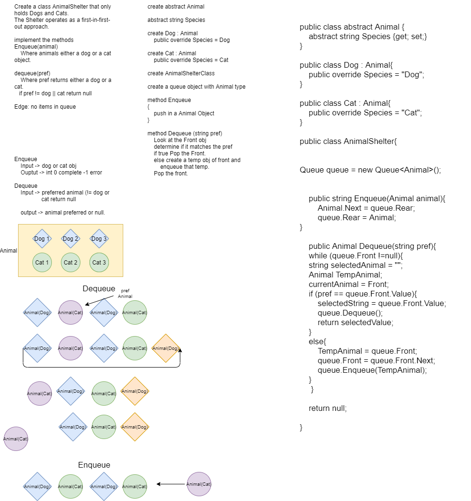

# Code Challenge 11 - AnimalShelter

## Create a Animal Shelter the Operates on a FIFO principle
**Author**: JP Jones

---

### Problem Domain
Create a class called AnimalShelter which holds only dogs and cats. The shelter operates using a first-in, first-out approach.
Implement the following methods:
enqueue(animal): adds animal to the shelter. animal can be either a dog or a cat object.
dequeue(pref): returns either a dog or a cat. If pref is not "dog" or "cat" then return null.

---

### Inputs and Expected Outputs

|Method| Input |Arguments|Expected Output   |
|: ---------| :----------- | :----------- |
|Enqueue| [Cat,Cat,Cat] | Dog |F[Cat, Cat, Car, Dog]R| 
|Dequeue| [Dog,Cat,Cat,Cat] |Cat | F[Cat,Cat,Cat,Dog]R

---

### Big O

| Time | Space |
| :----------- | :----------- |
| O(n) | O(n) |

---

### Whiteboard Visual

---

### Change Log

1.0: *Initial submission* - 26 Jan 21

---