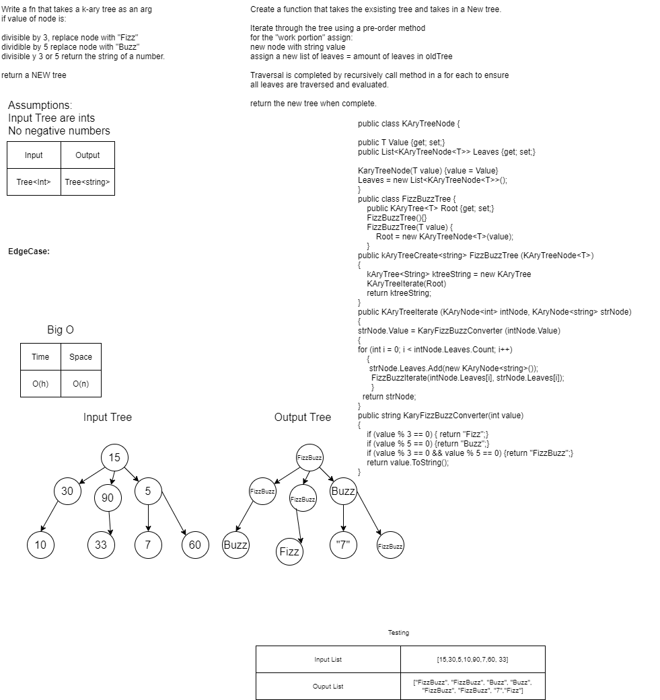

# Daily Code Challenge - 18

## FizzBuzz K-Ary Tree
*Author: JP Jones*

---

### Problem Domain

Write a function called FizzBuzzTree which takes a k-ary tree as an argument.
Without utilizing any of the built-in methods available, determine whether or 
not the value of each node is divisible by 3, 5 or both. Create a new tree with 
the same structure as the original, but the values modified as follows:

+ If the value is divisible by 3, replace the value with “Fizz”
+ If the value is divisible by 5, replace the value with “Buzz”
+ If the value is divisible by 3 and 5, replace the value with “FizzBuzz”
+ If the value is not divisible by 3 or 5, simply turn the number into a String.

---

### Inputs and Expected Outputs

| Input | Expected Output |
| :----------- | :----------- |
| K-Ary Int Tree [15,10,7,9] | K-Ary String Tree [FizzBuzz, Buzz, "7", "Fizz] |

---

### Big O

| Time | Space |
| :----------- | :----------- |
| O(w) | O(n) |

---

### Whiteboard Visual

---

### Change Log

1.0: *Initial Submission* - 3 Feb 2021  

1.1: *Completed Whiteboard* - 6 Feb 2021  

1.2: *Completed Coding* - 6 Feb 2021

1.3: *Completed Testing* - 6 Feb 2021

2.0: *Documentation Complete and Resubmitted* - 6 Feb 2021

---
