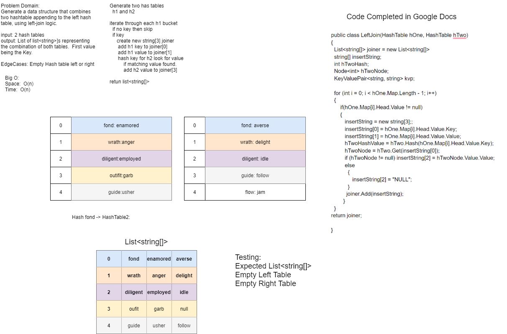

# Code Challenge 33 - LeftJoin

## A Tale of 2 HashTables and An Array of Arrays
**Author**: JP Jones

---

### Problem Domain
Create a Class the take 2 hash table and returns an array of arrays with values that are common in both.

---

### Inputs and Expected Outputs

| Input |Output   |
|2 Hash Tables| [ [ 1232 ][ 123 ] ]|

---

### Big O

| Time | Space |
| :----------- | :----------- |
| O(n) | O(n) |

---

### Whiteboard Visual
***[Your Whiteboard Image]***

---

### Change Log

1.0: *Initial submission* - 24 Feb 21

---