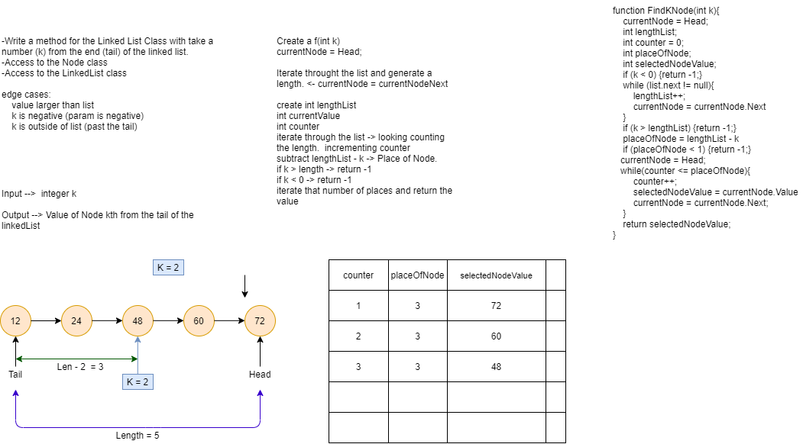

# Singly Linked List
This is an exercise in creation and manipulation of linked lists.

## Challenge

Create a Node class that has properties for the value stored in the Node, and a pointer to the next Node. Track and search through 
the linked list.

## Approach & Efficiency
Time: O(n)
Space: O(n)

## API

Print() - Uses While loop to print to the Screen
PrintR() - Uses a Recursive loop to display the list on the screen
Insert(val) - Insert a node into the list
Includes(val) - Search the link list for a value

# Inserting Into Linked Lists

## Challenge

Write a 3 methods that:

+ Append a Node to the end
+ Insert a Node *before* the selected Node
+ Insert a Node *after* the selected Node

Create Tests to test each of these methods.

##  Approach and Efficiency

After whiteboarding the problem, I attempted to use a Test Driven approach.
I wrote my tests before coding the methods.  After the methods passed the test, 
look for improvements.  

**Big O**
Time O(n)
Space O(n)

## API

Append(int value) - Append a Node to the Tail of the Linked List
InsertBefore(int value, int newValue) - Will insert BEFORE the selected Node with a New Node
InsertAfter(int value, int newValue) - Will insert AFTER the selected Node with a New Node

## Solution

# Finding the Kth Value from the Tail in a Linked List

## Challenge

Write a method that will find the Kth value from the tail of a *Linked List*.

Create Tests to test the following:

+ Where k is greater than the length of the linked list
+ Where k and the length of the list are the same
+ Where k is not a positive integer
+ Where the linked list is of a size 1
+ “Happy Path” where k is not at the end, but somewhere in the middle of the linked list

##  Approach and Efficiency

After whiteboarding the problem, I attempted to use a Test Driven approach.
There were a couple of area that required another look and re-evaluation of my whiteboard.  
+ Syncing a counter and iteration through the linked list.

**Big O**
Time O(n)
Space O(n)

## API

LocateKthNodeFromTail(int k) - Find the Kth value from the tail of a Linked List

## Solution

