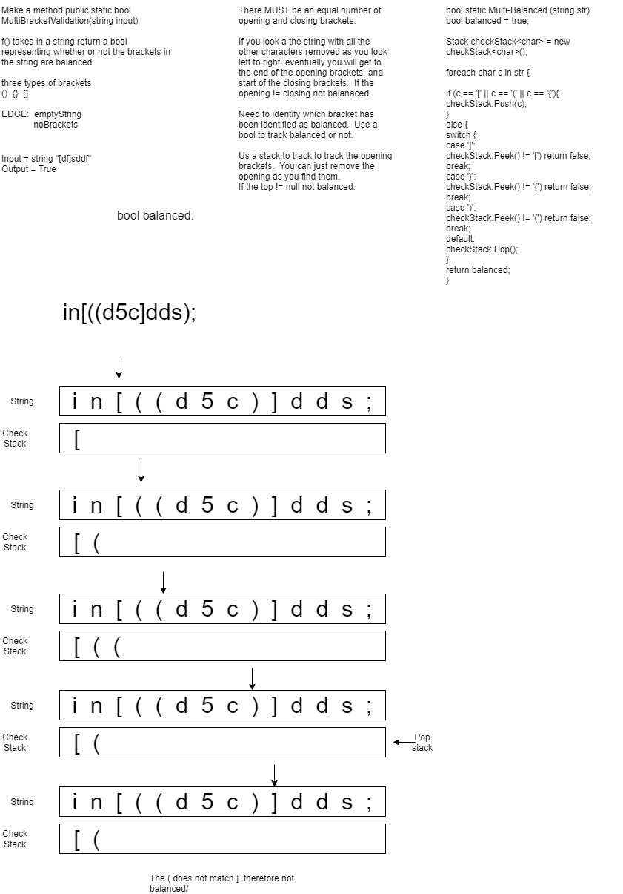

# Code Challenge 13 - Multi Bracket Validation

## Use stacks as queues
**Author**: JP Jones

---

### Problem Domain
Create a method that will return a bool.  It will return true if the string is balanced or false if it is not.

---

### Inputs and Expected Outputs

| Input |Output   |
|: ---------| :----------- |
|"{([df]fd)f}" | True | 
|"{([)]}| False |

---

### Big O

| Time | Space |
| :----------- | :----------- |
| O(n) | O(n) |

---

### Whiteboard Visual

---

### Change Log

1.0: *Initial submission* - 27 Jan 21

---