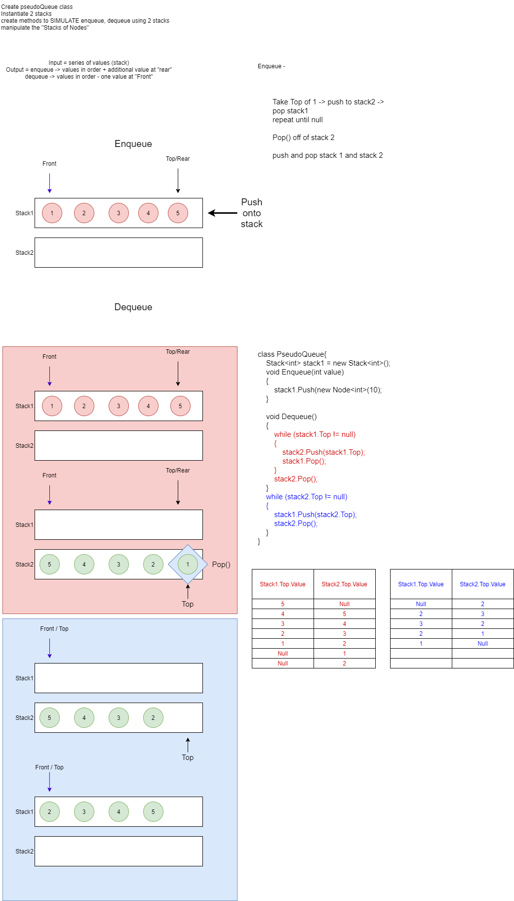

# Code Challenge 11 - PsuedoQueues

## Use stacks as queues
**Author**: JP Jones

---

### Problem Domain
Create a class PsuedoQueues that will perform as a queue, but using two *stacks* internally to perfrom
+ *Enqueue(int value)*
+ *Dequeue*

---

### Inputs and Expected Outputs

|Method| Input |Arguments|Expected Output   |
|: ---------| :----------- | :----------- |
|Enqueue| [10,15,20] | 25 |F[10, 15, 20, 25]R| 
|Dequeue| [10,15,20] |  | F[15, 20]R

---

### Big O

| Time | Space |
| :----------- | :----------- |
| O(n) | O(n) |

---

### Whiteboard Visual
***[Your Whiteboard Image]***

---

### Change Log

1.0: *Initial submission* - 25 Jan 21

---