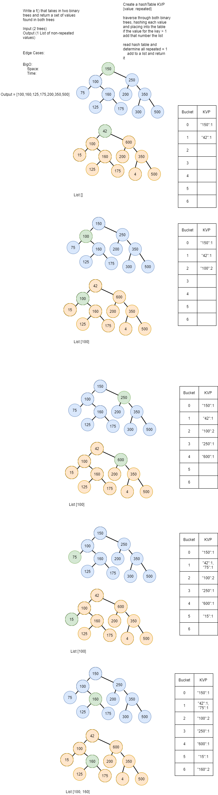

# Code Challenge 32 - Tree Intersection

## 2 Binary Trees Returning One List of Matching Values
**Author**: JP Jones

---

### Problem Domain
Create a class that will take in two binary trees and return a list of matching numbers

---

### Inputs and Expected Outputs

Input |Expected Output   |
| :----------- | :----------- |
|2 Binary Trees (Some values are equal)|[Matching Values]|

---

### Big O

| Time | Space |
| :----------- | :----------- |
| O(n) | O(n) |

---

### Whiteboard Visual
***[Your Whiteboard Image]***

---

### Change Log

1.0: *Initial submission* - 23 Feb 21

---