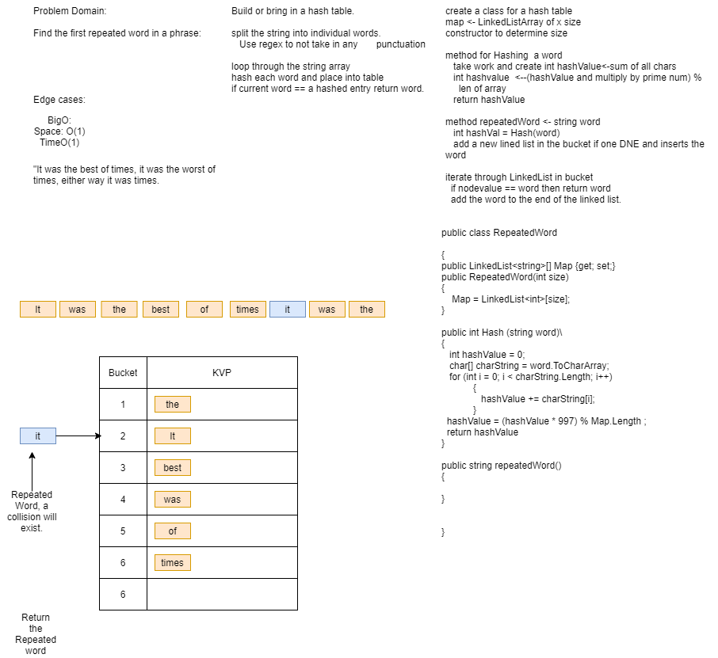

# Code Challenge 31 - Repeated Word

## Use Hash Tables to find a Repeated Word
**Author**: JP Jones

---

### Problem Domain
Create a method that will return the first repeated word

---

### Inputs and Expected Outputs

| Input |Output   |
|: ---------| :----------- |
|"Once upon a time, there was a brave princess who..." | "a" | 

---

### Big O

| Time | Space |
| :----------- | :----------- |
| O(1) | O(1) |

---

### Whiteboard Visual

---

### Change Log

1.0: *Initial submission* - 2/22/21 <--Happy 40th Me

---